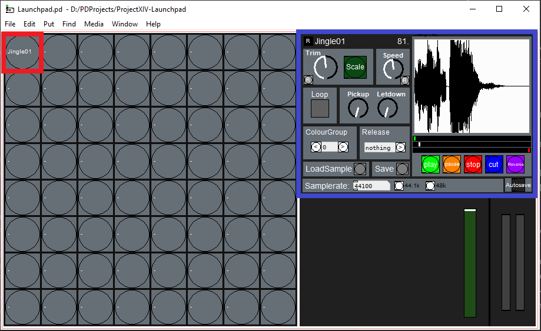
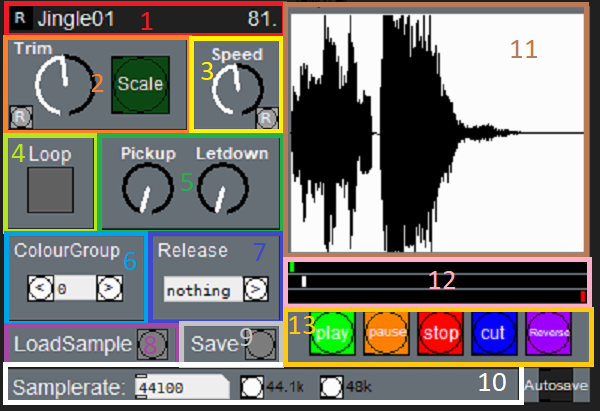

# LaunchpadRadioTool
Very old project (don't judge!) for using a launchpad to drive a sampler/playback system.

## Installation
1. Download and install [PD-Extended](https://puredata.info/downloads/pd-extended)
2. Download a copy of the [LaunchpadRadioTool](https://github.com/BoltMk0/LaunchpadRadioTool/archive/master.zip) project
and unzip.

## Seting up Pd-Extended
_Pd-Extended is horrendously buggy software, and you will likely experience a complete loss of audio whilst performing
these steps. If this does happen, simply close and reopen Pd-Extended. If you experience repetitive crashing when 
opening Pd-Extended, pray to the gods you have wronged and google answers. Perhaps an uninstall/reinstall?_
1. Run Pd-Extended
2. Click "Media" in the toolbar, and then "standard MMIO" (if you have a dedicated soundcard with ASIO drivers installed,
click "ASIO (via portaudio)" instead)
3. Ensure you have the expected devices selected in the device selector boxes.
4. Set the Sample rate (44100 is fine), Block size (A.K.A. buffer size, start with 128), and Delay (start with 100).
5. Keeping this window open and going back to the main window, navigate to "Media -> Test Audio and MIDI..."
6. In the upper left of the newly opened window, below "Test Tones", click on the radio button to the left of "60".
7. You should now hear a tone. How does the audio sound? If bad, try playing around with the Block size and delay. 
My machine (6-core 4.0GHz) works best with Block size 64 and can achieve a Delay of about 24ms, but I use 50 to be safe. 
Yours may differ. If it sounds clean, you're ready to go.
8. OPTIONAL: You may choose to try minimising the Delay value and Block size to achieve best performance. The benefit is
snappier response after pushing a button.

## Using LaunchpadRadioTool
The main program can be found (relative to the downloaded unzipped folder) at: 

`./src/Launchpad.pd`

Either open this file from within Pd-Extended or run the file, and you should see something resembling this:

_NOTE: The loading progress is shown in the Pd-Extended main window. This can get quite
long as you load in more samples, so beware!_

To the left are all the available pads to be used. Click on any of these to load them into the editor (shown highlighted
in blue).

#### Editing a pad
The pad editor panel looks like this:

#####1) Name
Here the name of the pad can be set. This is purely cosmetic, though comes in very useful for keeping
track of your layout. The number to the right reflects the unique pad number.

To rename a pad click the "R" to the left and type. Names cannot contain spaces. When you are done, hit
the enter key, or click "R" again.

#####2) Trim
If the pad is too quiet, you can boost the volume here. I think it's -12 to +12 dB.

[R] Reset the trim to 0dB

[Scale] Apply the trim to the samples (WARNING: only use this if the trim is not enough!)

#####3) Speed
Adjust the speed of the sample playback here. NOTE: If the sample isn't playing
back at the right speed to start with, check the sample rate (10)

[R] Reset the speed.

#####4) Loop
Checking this box makes the sample loop continuously until stopped.

#####5) Pickup/Letdown
The most fun of them all. Think about each pad as a vinyl player/turntable:
Pickup affects how long it takes the turntable to reach its
set speed, letdown affects how long it takes it to stop. Have a play!

#####6) Color Group
Set the color for this pad (NOTE: Affects the launchpad buttons AND the GUI).
This program was intended for the Launchpad Mk2, so the colors may not match with other devices.

#####7) Release
The release function (what happens when you let go of the button) for each pad.
- "nothing": nothing happens. Each press is a new "start" command (useful for
stuff like the reggae horn etc.)
- "altstop": Alternative stop. Nothing on release, but overy other press is a 
"stop" command. (i.e. push to start, then push to stop)
- "stop": Stop playback on release
- "pause": Pause playback on release

#####8) LoadSample
Click here to load a new sample into the pad

#####9) Save
Save the pad settings. Be sure to do this otherwise the program won't remember
your settings! Saving can take a long time.

#####10) Samplerate
The samplerate of the loaded sample, NOT THE SAMPLE RATE OF THE AUDIO DRIVER!
If the pad is playing back slower/faster than expected, try changing the samplerate.

#####11) Sample array view
Purely cosmetic representation of the sample. Lines up with AdmiralTrackbar.

#####12) Admiral Trackbar
Use this to:

- GREEN - Set the playback start position
- RED - Set the playback stop position

relative to the Sample array view. The white is purely cosmetic.

#####13) Other Controls
- "Play": Simulate "play" command, starting playback.
- "Stop": simulate "stop" command, stopping playback.
- "Pause": you get the idea
- "Cut": Trim the sample array to the bounds set by AdmiralTrackbar. Saves memory
and makes loading faster. THIS CANNOT BE UNDONE!
- "Reverse": Does what it says on the tin - reverses the sample.

#####14) Autosave
ADVICE: Avoid using this. Automatically saves the pad config after a second 
(maybe?) of inactivity. Saving takes a long time.
